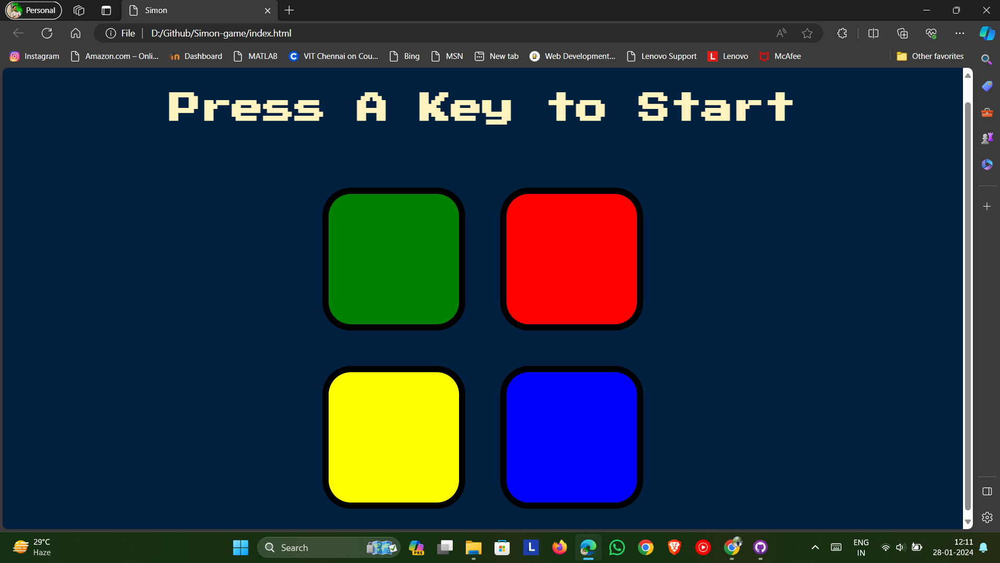

# Simon game

Simon is a game that tests your memory and concentration skills. The game consists of four colored buttons: green, red, yellow, and blue. Each button makes a different sound when pressed. The game will play a sequence of colors and sounds, and you have to repeat it by pressing the buttons in the same order. The sequence gets longer and faster with each level, making it more challenging to remember. The game has two modes: normal and strict. In normal mode, you can make mistakes and try again. In strict mode, if you make a mistake, the game will reset and you have to start from the beginning

## Preview

